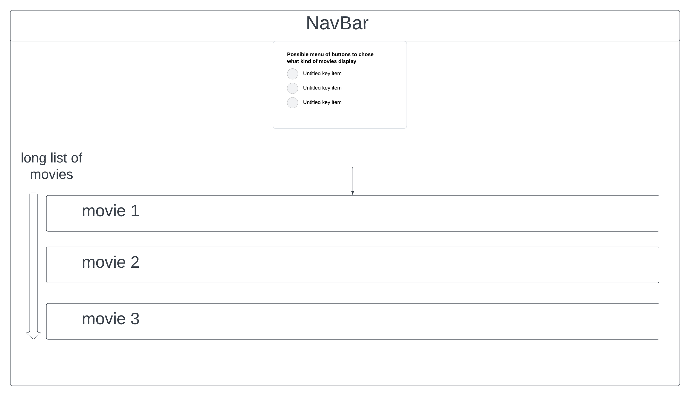
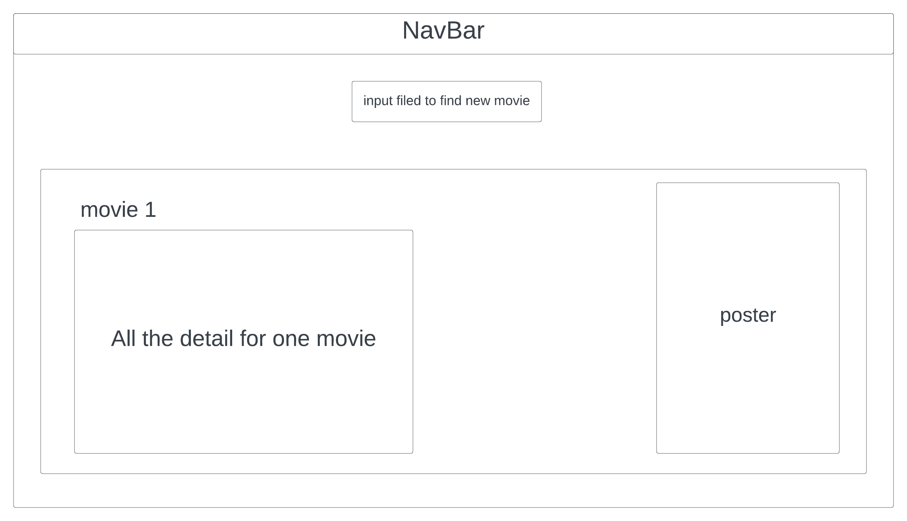
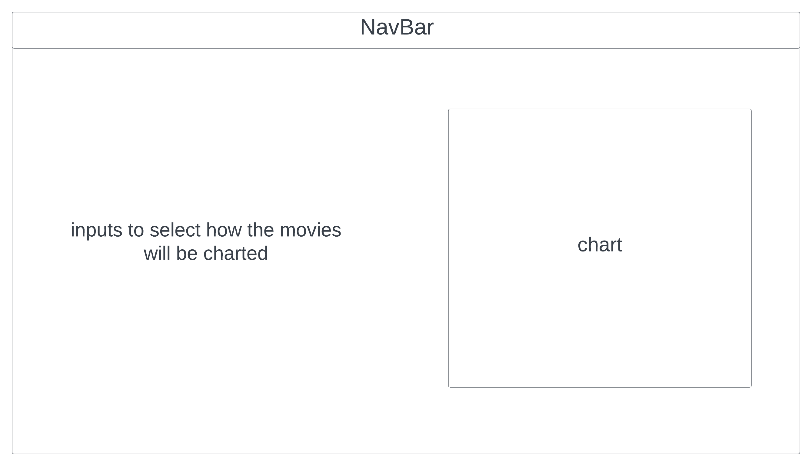

# Title
Movie Database

## Data
This data set contains information about 10,760 movies collected from The Movie Database (TMDb) between 1961 and 2015. 
it contains a lot of information about each movie
- ID: Movie ID
- Popularity: Popularity score
- Budget: Amount spent to make the movie
- Revenue: Amount realized from the movie
- original title: Movie title
-  Cast: Actors & Actresses in the movie
-  Homepage: Movie website
-  Director: Director(s) of the movie
-  Tagline: Catchphrase(s)/slogan of the movie
-  keywords: Words associated with a movie
-  Overview: Movie Summary
-  Runtime: length of a movie
-  Genres: Category
-  Production companies: Companies that produced the movie
-  Release date: Date movie was released
-  Vote count:
-  Vote average
-  Release year: year movie was released
-  Budget adj: Budget In terms of 2010 dollars
-  Revenue adj: Revenue in terms of 2010 dollars

## API
The server will have 3 endpoints
- Get route all 10,760 movies
- Get route for all movies in a year
- Get route for all data of one movie

## Visualization
We want the user to be able to moves through an entire database of movies and to compare how the budget, ratings ,revenue and gross have changes over the years

## Views

This page is a long list of movies that will go offscreen, pass under the fold. clicking on one will bring you to the details page.

this page will be for displaying all the data of a given movie. might have a button to show another

this page is our visulaization, it will have a char with inputs to control how movies are charted

## Functionality
The user will interact with inputs to control what movies display and how they are graphed 

## Features and Priorities
- Core features are how we graph the movies, this is the important part. We will be able to graph movies 2-4 different ways, it is most important to get at least 2 working perfectly
- listing movies and getting all data for individual movies is extra.

## Dependencies
we will probably use react-plotly to graphe movies